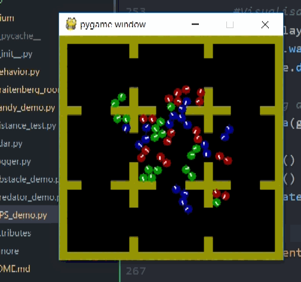

# Vivarium

Environnement de simulation multi-agent avec un paradigme écologiquement valide.
Basé sur [SimplePlaygrounds](https://github.com/mgarciaortiz/simple-playgrounds).

Développé par Younès Rabii, encadré par Clément Moulin-Frier.
Avec l'aide précieuse de Michaël Garcia Ortiz.

[Rapport de stage](documents/rapport.pdf)

Février - Juillet 2020

## Dépendances
- `simple_playgrounds` v0.9.18 (anciennement `flatland`)
- `tqdm`

## Installation

Exécuter la commande suivante  dans le dossier racine du repot:
`pip install .`

Lancer [RPS_demo.py](vivarium/RPS_demo.py) ou [candy_demo.py](vivarium/candy_demo.py)

## Contenu
- [lidar.py](vivarium/lidar.py) - code du senseur géométrique
- [behavior.py](vivarium/behavior.py) - code des comportements de Braitenberg
- [candy_demo.py](vivarium/candy_demo.py) - map demo pour tester le comportement d'un agent
- [RPS_demo.py](vivarium/RPS_demo.py) - simulation RPS (cf rapport)

## Dynamiques de la simulation RPS
- Chaque agent a un corps physique: ils peuvent se pousser, bloquer des chemins
- Ils ont une notion d'énergie interne (0 = mort)
- Ils peuvent voler de l'énergie à leur proies, quand ils sont dans un rayon suffisemment proche
- Il se reproduisent en se séparant en deux (séparation cellulaire), l'énergie est partagée
- Ils ont une superposition de comportements bio-inspirés (Braitenberg): chasse de proie, évitement de prédateur et d'obstacles

## Paramètres modifiables directement:
- Nombre d'espèces différentes
- Morphologie de chaque espèce: taille, vitesse linéaire et angulaire, rayon d'attaque
- Forme de l'environnement: taille, obstacles qui séparent la carte en cases
- Espace d'observation : distance et angles de vue, entités perçues
- Comportement de chaque espèce: combinaisons de 4 comportements primitifs (Braitenberg), coefficients pour chaque comportement et chaque entité, mode de reproduction (séparation cellulaire, seuil de séparation)

## Exemples

Lien vers le [dossier Drive](https://drive.google.com/drive/folders/1j6QxPkTobYtV7kwNXbiqEAK5U-HHmtqt?usp=sharing) contenant des exemples vidéos de simulation et des plots de population.

Paramétrisation:
1. paramètres par défaut
2. paramètres par défaut
3. segmentation 3x3
4. segmentation 5x5
5. vitesses linéaires et angulaire x2
